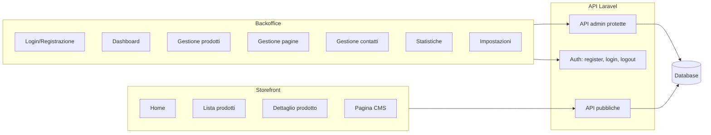

# Piano sistema 360° — Vetrina + Backoffice completo

Sistema tipo WordPress ma ultra moderno, stile Apple: vetrina dinamica (dettaglio prodotto ricco, pagine CMS, etichette, video, caratteristiche) e backoffice completo con auth, CRUD prodotti/pagine, gestione contatti, statistiche.

---

## 1. Architettura generale



- **Storefront** (frontend Vite statico): home, lista prodotti, **dettaglio prodotto** (titolo, descrizione, caratteristiche elenco puntato, galleria immagini, video, etichette), pagine CMS.
- **Backoffice** (stesso frontend Vite): login/registrazione pubblica → dashboard, gestione prodotti (CRUD, ordine, immagini, attributi, tag, video), pagine, contatti ricevuti, statistiche (viste prodotto), impostazioni.
- **Backend**: API pubbliche (già presenti) + auth (register/login/logout) + API admin protette da middleware auth + ruolo.

---

## 2. Schema database esteso

### 2.1 Tabelle esistenti (da mantenere)

- `users`, `password_reset_tokens`, `sessions`
- `cache`, `cache_locks`, `jobs`, `job_batches`, `failed_jobs`
- `system_modules`, `categories`, `products`, `media`, `pages`, `settings`

### 2.2 Estensioni tabella `users`

- **`role`** — enum o string: `admin` | `editor` | `user`. Solo `admin` e `editor` accedono al backoffice; `user` può essere usato per area riservata futura o solo registrazione.

### 2.3 Estensioni tabella `products`

- **`video_url`** — string nullable (URL YouTube/Vimeo o altro embed).
- **`label`** — string nullable: etichetta singola in evidenza (es. "Nuovo", "Ultimi arrivi", "Promo"). In alternativa si usa la tabella `product_tags` per più etichette.

### 2.4 Nuove tabelle

| Tabella | Scopo |
|--------|--------|
| **`product_attributes`** | Caratteristiche prodotto (elenco puntato). `product_id`, `sort_order`, `label`, `value` (es. "Colore" / "Rosso"). |
| **`product_tags`** | Tag riutilizzabili (es. "Nuovo", "Ultimi arrivi", "In offerta"). `id`, `name`, `slug`, `sort_order`. |
| **`product_product_tag`** | Pivot many-to-many: `product_id`, `product_tag_id`. |
| **`product_inquiries`** | Richieste informazioni dal form prodotto. `id`, `product_id` nullable, `name`, `email`, `message`, `status` (new/read/closed), `notes` (interno), `created_at`, `updated_at`. |
| **`product_views`** | Conteggio/tracciamento viste. `id`, `product_id`, `viewed_at` (date o datetime), `session_id` o `ip` (opzionale, per statistiche aggregate). Oppure solo `product_id`, `date`, `count` per aggregato giornaliero. |

Scelta proposta per `product_views`: una riga per vista con `product_id`, `viewed_at` (timestamp), `session_id` (nullable string, per evitare doppi conteggi in sessione). Le statistiche si ricavano con query aggregate (GROUP BY product_id, DATE(viewed_at)).

### 2.5 Riepilogo campi prodotto (dettaglio pagina)

- Titolo: `name`
- Slug: `slug`
- Descrizione breve: `short_description`
- Descrizione lunga: `description` (HTML)
- Prezzi: `price`, `compare_at_price`
- Galleria: relazione `media` (immagini, ordinate da `sort_order`)
- Video: `video_url`
- Caratteristiche (elenco puntato): tabella `product_attributes` (label + value)
- Etichette: tabella `product_tags` via pivot (es. "Nuovo", "Ultimi arrivi")
- SEO: `meta_title`, `meta_description`
- Ordinamento: `sort_order`; stato: `is_active`, `is_featured`

---

## 3. Backend — Autenticazione

- **POST /api/register** — body: `name`, `email`, `password`, `password_confirmation`. Crea utente con `role = user` (o `editor` se si vuole registrazione diretta editor). Validazione Laravel; password hashata dal model.
- **POST /api/login** — body: `email`, `password`. Login con sessione (guard `web`). Risposta: `{ user: {...} }`.
- **POST /api/logout** — invalida sessione.
- **GET /api/user** — ritorna utente corrente (già presente, protetto da auth:sanctum o auth:session).

Protezione API admin: middleware che verifica `auth` + ruolo `admin` o `editor`. Se l’utente non è autenticato → 401; se non ha ruolo adatto → 403.

---

## 4. Backend — API admin

Tutte sotto prefisso `/api/admin`, middleware `auth:sanctum` (o sessione) + ruolo admin/editor.

### 4.1 Prodotti

- **GET /api/admin/products** — lista (paginata, filtri per categoria, tag, stato). Include relazioni: category, media, tags, attributes. Ordinamento per sort_order, id.
- **POST /api/admin/products** — crea prodotto (name, slug, short_description, description, price, compare_at_price, video_url, category_id, is_active, is_featured, sort_order, meta_title, meta_description). Opzionale: array `attributes` [{ label, value }], array `tag_ids` [].
- **GET /api/admin/products/{id}** — dettaglio per modifica (con media, attributes, tags).
- **PUT /api/admin/products/{id}** — aggiorna (stessi campi + gestione attributes/tags).
- **DELETE /api/admin/products/{id}** — elimina.
- **PUT /api/admin/products/reorder** — body: `{ ids: [id1, id2, ...] }`. Aggiorna `sort_order` in base all’ordine dell’array.

Upload immagini: **POST /api/admin/products/{id}/media** — multipart, file image. Salva in `media` (mediaable_type = Product, mediaable_id = id), sort_order incrementale. **DELETE /api/admin/products/{id}/media/{mediaId}** — rimuove media e file dal disco. **PUT /api/admin/products/{id}/media/reorder** — body `{ media_ids: [...] }` per aggiornare sort_order.

### 4.2 Pagine CMS

- **GET /api/admin/pages** — lista.
- **POST /api/admin/pages** — crea (title, slug, body, meta_title, meta_description, is_active, sort_order).
- **GET /api/admin/pages/{id}** — dettaglio.
- **PUT /api/admin/pages/{id}** — aggiorna.
- **DELETE /api/admin/pages/{id}** — elimina.
- **PUT /api/admin/pages/reorder** — come prodotti.

### 4.3 Categorie

- **GET /api/admin/categories** — lista ad albero (per select in form prodotto).
- **POST /api/admin/categories**, **PUT /api/admin/categories/{id}**, **DELETE** — CRUD se si vuole gestire categorie dal backoffice (opzionale nella prima fase).

### 4.4 Contatti (richieste informazioni)

- **GET /api/admin/inquiries** — lista product_inquiries (paginata, filtri status). Include product (name, slug).
- **GET /api/admin/inquiries/{id}** — dettaglio.
- **PUT /api/admin/inquiries/{id}** — aggiorna status e notes (solo admin/editor).

L’endpoint pubblico **POST /api/contact/product** salva in `product_inquiries` (product_id, name, email, message; status = 'new').

### 4.5 Statistiche

- **GET /api/admin/stats/overview** — conteggi: prodotti attivi, pagine, richieste nuove, (opzionale) totale viste ultimi 30 gg.
- **GET /api/admin/stats/product-views** — prodotti più visti (aggregato su `product_views`): product_id, product name, numero viste, trend ultimi 7/30 gg. Parametri: `days=30`, `limit=20`.

Registrazione vista: quando il frontend apre la pagina dettaglio prodotto, chiama **POST /api/public/products/{slug}/view** (o **POST /api/track/product-view** con product_id) che inserisce una riga in `product_views` (product_id, viewed_at, session_id). Throttle per sessione (es. 1 vista per prodotto per sessione al giorno).

### 4.6 Impostazioni

- **GET /api/admin/settings** — ritorna tutte le chiavi/valori (per form impostazioni).
- **PUT /api/admin/settings** — body: `{ key: value, ... }`. Aggiorna o crea voci in `settings`.

---

## 5. Backoffice frontend (Vite, stile Apple)

- **Pagine HTML** (tutte sotto `/frontend/dist/` con base corretta):
  - **admin-login.html** — form login (email, password). Link “Registrati” → admin-register.html.
  - **admin-register.html** — form registrazione (name, email, password, password_confirmation). Dopo successo redirect a admin.html.
  - **admin.html** — dashboard (card riepilogo: prodotti, pagine, richieste nuove, viste; ultimi prodotti/pagine; link rapidi).
  - **admin-prodotti.html** — lista prodotti (tabella con nome, prezzo, stato, etichette, azioni Modifica/Elimina/Apri in vetrina). Pulsante “Nuovo prodotto”. Ordinamento drag-and-drop o numeri.
  - **admin-prodotto.html** — form crea/modifica prodotto (query `?id=123` per modifica): nome, slug, descrizione breve, descrizione lunga (textarea/HTML), prezzo, compare_at_price, video_url, categoria (select), is_active, is_featured, sort_order, meta. Sezione **Caratteristiche**: lista dinamica label/value (aggiungi/rimuovi riga). Sezione **Etichette**: multiselect o checkbox da product_tags. Sezione **Immagini**: upload multiplo, anteprima, ordine (drag o numeri), elimina. Salva via POST/PUT admin API.
  - **admin-pagine.html** — lista pagine + form nuova/modifica (title, slug, body HTML, meta, is_active, sort_order).
  - **admin-contatti.html** — tabella richieste (data, nome, email, prodotto, messaggio, status). Dettaglio/modale con notes e cambio status.
  - **admin-statistiche.html** — grafico/tabella “Prodotti più visti” (ultimi 7/30 gg), eventuale trend. Dati da GET /api/admin/stats/product-views.
  - **admin-impostazioni.html** — form con campi da settings (site_name, hero_title, footer_text, logo_url, ecc.). Salvataggio con PUT /api/admin/settings.

- **Stile**: stesso `apple.css` con classi `.admin-*`; layout pulito, tabelle ordinate, form con label/input coerenti, bottoni primari/secondari, feedback successo/errore (toast o messaggio inline).

- **Auth**: al caricamento di qualsiasi pagina admin (eccetto login/register), script JS verifica GET /api/user; se 401 redirect a admin-login.html. Token/sessione: le chiamate fetch alle API admin includono credentials (cookie) se si usa sessione Laravel.

---

## 6. Storefront — Dettaglio prodotto e listing

### 6.1 Dettaglio prodotto (prodotto.html?slug=...)

- **Layout**: header comune, breadcrumb (Home > Prodotti > Nome prodotto), contenuto a due colonne (desktop): galleria a sinistra, info a destra.
- **Galleria**: immagine principale + thumbnails (da `media`); click thumb cambia principale. Se c’è `video_url`, mostrare anche blocco embed (iframe YouTube/Vimeo) sotto o accanto alla galleria.
- **Info**: titolo (name), prezzo (price, eventuale compare_at_price barrato), descrizione breve, **caratteristiche** (da product_attributes: lista puntata label – value).
- **Etichette**: sopra o sotto il titolo, badge per ogni tag (es. “Nuovo”, “Ultimi arrivi”) con stile discreto.
- **Descrizione lunga**: HTML (description) sotto le caratteristiche.
- **Form richiesta informazioni**: come già previsto (nome, email, messaggio); submit a POST /api/contact/product. Opzionale: chiamata POST per registrare vista (product view) quando la pagina viene caricata (una volta per sessione per prodotto).

### 6.2 Lista prodotti (prodotti.html)

- Filtri: per categoria (dropdown), per tag (pill o select). Parametri query `?category_id=1&tag=nuovo`. Chiamata API: GET /api/public/products con filtri; lato backend si estende per accettare `tag` (slug tag) e `category_id`.
- Card prodotto: immagine, nome, descrizione breve, prezzo, **etichette** (badge). Link a prodotto.html?slug=...
- Sezione “Ultimi arrivi”: stessa griglia ma prodotti con tag “ultimi-arrivi” o ordinati per created_at (GET /api/public/products?sort=newest&per_page=8). Opzionale.

### 6.3 Home

- Hero da settings. Blocco “In evidenza” (is_featured). Eventuale blocco “Ultimi arrivi” (prodotti con tag o ordinati per data). Stile coerente Apple.

---

## 7. Ordine di implementazione

1. **Schema DB**: migrazioni Laravel per role su users, video_url e label su products, product_attributes, product_tags, product_product_tag, product_inquiries, product_views. Aggiornare docs/schema.sql e SCHEMA-DATABASE.md.
2. **Auth**: RegisterController, LoginController (o un AuthController), route API register/login/logout; middleware ruolo; GET /api/user già esistente.
3. **Modelli**: Product (fillable video_url, label; relazioni attributes, tags), ProductAttribute, ProductTag, ProductInquiry, ProductView. User: fillable role; cast role.
4. **API admin prodotti**: AdminProductController (CRUD, reorder, media upload/delete/reorder, attributes, tags). Estendere PublicController prodotti per includere attributes, tags, video_url; filtro per tag e category_id.
5. **API admin pagine, inquiries, stats, settings**: controller e route.
6. **Tracking vista**: endpoint POST per registrare vista + throttle; chiamata dal frontend su dettaglio prodotto.
7. **Backoffice Vite**: pagine admin-login, admin-register, admin.html (dashboard), admin-prodotti, admin-prodotto (form), admin-pagine, admin-contatti, admin-statistiche, admin-impostazioni. JS per auth check, form, chiamate API.
8. **Storefront**: estendere prodotto.js e prodotti.js per mostrare caratteristiche, video, etichette; form contatti già presente; opzionale chiamata track view.

---

## 8. Sicurezza e buone pratiche

- Password: sempre hashate (Laravel cast `hashed` sul model User).
- Validazione input su tutte le route (Form Request o validate()).
- API admin protette da auth + ruolo; CORS e cookie Same-Site configurati per il dominio.
- Upload file: solo tipi immagine consentiti, nome file randomizzato, path non eseguibile.
- Throttle su login/register e su track view per evitare abusi.

---

## 9. File da creare/modificare (riferimento)

**Backend (Laravel)**  
- Migrazioni: add_role_to_users, add_video_url_label_to_products, create_product_attributes, create_product_tags, create_product_product_tag_table, create_product_inquiries, create_product_views.  
- Modelli: User (role), Product (video_url, label, attributes(), tags()), ProductAttribute, ProductTag, ProductInquiry, ProductView.  
- Controller: AuthController (register, login, logout), Admin/ProductController, Admin/PageController, Admin/InquiryController, Admin/StatsController, Admin/SettingController; estensione PublicController e ContactController.  
- Route: api.php (auth + admin prefix).  
- Middleware: CheckAdminRole (o simile).

**Frontend (Vite)**  
- Nuove pagine: admin-login.html, admin-register.html, admin-prodotti.html, admin-prodotto.html, admin-pagine.html, admin-contatti.html, admin-statistiche.html, admin-impostazioni.html.  
- Nuovi script: admin-auth.js (login/register, redirect se non auth), admin-prodotti.js, admin-prodotto.js (form + upload), admin-pagine.js, admin-contatti.js, admin-statistiche.js, admin-settings.js.  
- Estensioni: prodotto.js (caratteristiche, video, etichette, track view), prodotti.js (filtri tag/categoria, badge), home.js (ultimi arrivi se si aggiunge).  
- vite.config.mjs: aggiungere input per le nuove HTML.

**Docs**  
- SCHEMA-DATABASE.md: descrizione nuove tabelle e campi.  
- schema.sql: CREATE TABLE per tutte le tabelle incluso le nuove.

Implementazioni successive seguiranno questo piano in ordine logico (DB → auth → admin API → backoffice UI → storefront detail).

---

## 10. Primo accesso

Dopo aver creato il database ed eseguito migrazioni e seed:

```bash
cd backend
php artisan migrate
php artisan db:seed
```

L’utente di test creato dal seed ha **email** `test@example.com`, **password** `password` e **ruolo** `admin`. Usa queste credenziali per accedere al backoffice (admin-login.html). Per dare accesso ad altri utenti, imposta manualmente la colonna `role` a `admin` o `editor` nella tabella `users` (la registrazione pubblica crea utenti con `role = user`).
